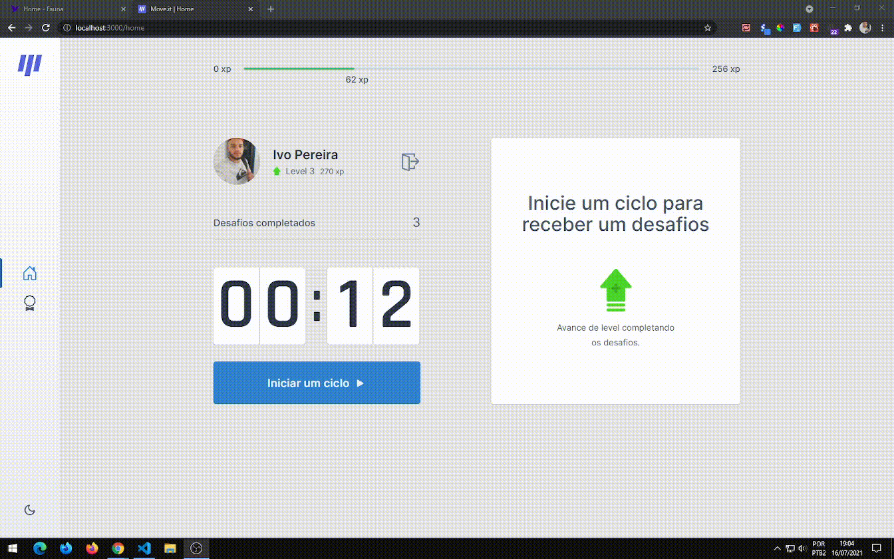

<h3 align="center">
<b>Semana Next Level Week 4 <p><a href="https://rocketseat.com.br"></a></p></b>

</h3></b></br>


------------------
</br>

<h2 align="center">
	🚧  Moveit em desenvolvimento 🚀🚧
</h2>

<p align="center">
  

  

  
</p>

</br>

Tabela de conteúdos
=================
<!-- vscode-markdown-toc -->
* [Sobre o projeto](#Sobreoprojeto)
* [Move.it](#Move.it)
* [Demo](#Demo)
* [Deploy](#Deployhttps:letsgo.vercel.app)
* [Tecnologias](#Tecnologias)
* [Pré-requisitos](#Pr-requisitos)
* [Como executar o projeto](#Comoexecutaroprojeto)
* [Licença](#Licena)

<!-- vscode-markdown-toc-config
	numbering=true
	autoSave=true
	/vscode-markdown-toc-config -->
<!-- /vscode-markdown-toc -->
</br>


</br>
</br>

##  <a name='Sobreoprojeto'></a> ℹ️ Sobre o projeto

O projeto foi ministrado pelo <a href="https://github.com/diego3g">Diego fernandes</a>, CTO da <a href="http://rocketseat.com.br">Rocketseat</a> e foi inspirado para ajudar devs e pessoas que passam horas em frente ao computador

</br>


## <a name='Move.it'></a>Move.it

O Move.it é um App que propõe desafios que são recompensados com xp quando completados esses desafios visão ajudar pessoas que trabalha por horas sentado em frente a um computador a fazer alongamentos para o corpo e olhos e com isso trazer benefícios ao corpo. 💜

</br>

### Features

- [x] Thema light e dark
- [x] Cadastro caso não tenha e login com github

</br>

## <a name='Demo'></a>🎬 Demo

</br>



</br>
</br>

## Oque tem de novo 🤔
- Design da versão 2.0 desenvolvido por  <a href='https://www.instagram.com/tiagoluchtenberg/'>Tiago luchtenberg</a>
- Persistência de dados com o faunadb
- Autenticação e login com o nextAuth
- Thema light - dark


</br>

## <a name='Deployhttps:letsgo.vercel.app'></a>Deploy https://letsgo.vercel.app/

</br>

## <a name='Tecnologias'></a>🛠️ Tecnologias

As seguintes ferramentas foram usadas na construção do projeto:

- [Chakra-ui](https://chakra-ui.com/)
- [Nextjs](https://nextjs.org/)
- [NextAuth.js](https://next-auth.js.org/)

</br>

## <a name='Pr-requisitos'></a> Pré-requisitos

Antes de começar você vai precisar ter o <a href="https://nodejs.org/en/">Nodejs</a> ou instalar ele caso não tenha e também o <a href="https://yarnpkg.com/">Yarn</a>,

Você pode mudar o banco de dados aqui eu estou utilizando o <a href="https://fauna.com/">faunadb</a> se for usar ele também você precisa criar uma conta caso não tenha e grátis e também tem que configurar o git pois o login esta sendo feito com o nextauth.js que realiza o login utilizando o provider do github.


</br>

## <a name='Comoexecutaroprojeto'></a> ⚙ Como executar o projeto

</br>


```bash
# Clone este repositório
$ git clone https://github.com/ivopereira-jr/Next-Level-Week-4.git

# Instale as dependências
$ yarn

# Execute a aplicação
$ yarn dev

# O servidor inciará na porta:3000 - acesse http://localhost:3000
```

</br>

## <a name='Licena'></a> 📝 Licença

Este projeto esta sobe a [Licença MIT](./LICENSE).

Feito com 🧡 por Ivo Pereira ✌🏽 [Entre em contato ](https://www.linkedin.com/in/ivopereira-jr/)
