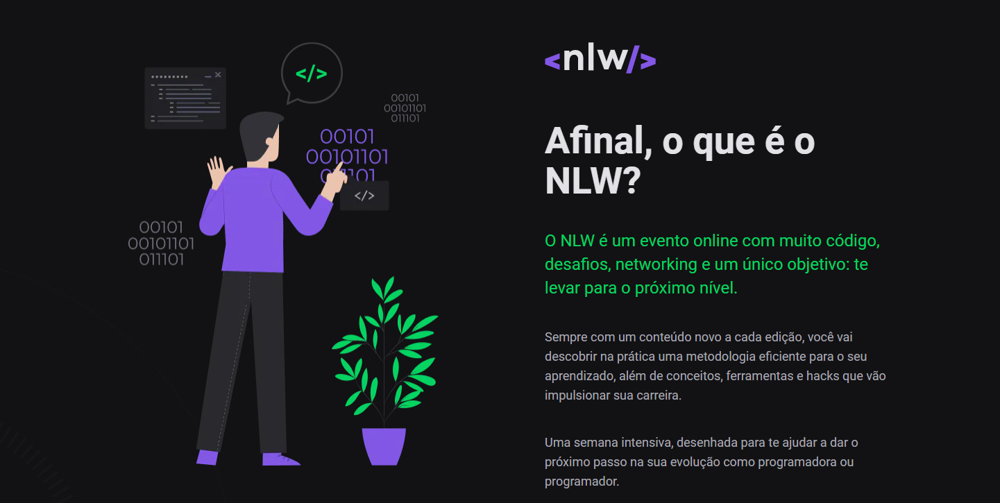
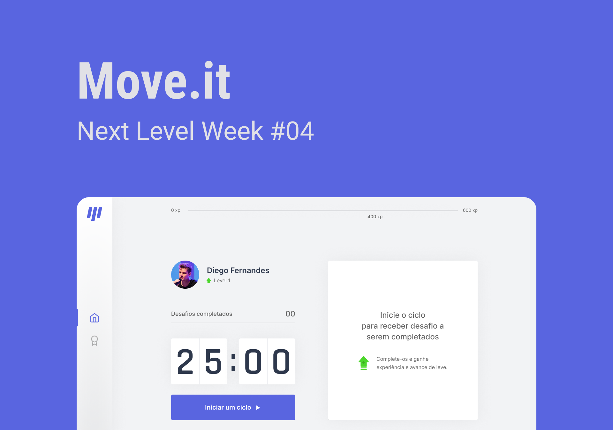

<h3 align="center">
<b>Semana Next Level Week 4 <p><a href="https://rocketseat.com.br"></a></p></b>

</h3></b></br>

      
   
------------------
</br>

## Sobre o projeto que foi desenvolvido:

O projeto foi ministrado pelo <a href="https://github.com/diego3g">Diego fernandes</a>, CTO da <a href="http://rocketseat.com.br">Rocketseat</a>

</br>

## Move.it

O Move.it é um App que propõe desafios que são recompensados com xp quando completados esses desafios visão ajudar a pessoa que trabalha por horas sentado em frente a um computador a fazer alongamentos para o corpo e olhos e com isso trazer os benefícios a essa pessoa. 💜

</br></br>

  
</br></br>

---

</br>
 
## 🚀  <strong>Tecnologias utilizadas:</strong>

- CSS3
- ReactJs
- Next.Js
- TypeScript

</br></br>

## 💻 Como Utilizar

```bash

# clonar o repositório
$ git clone https://github.com/ivopereira-jr/Next-Level-Week-4.git

# instalar as dependências
$ yarn install
$ npm install

# para iniciar
$ yarn dev


Obs. Você pode utlizar npm ou yarn eu utilizei o yarn
```

</br>
</br>

## 💬 Fale comigo

[_Entre em contato comigo_](https://www.linkedin.com/in/ivopereira-jr/)

Obrigado por chegar até aqui!
